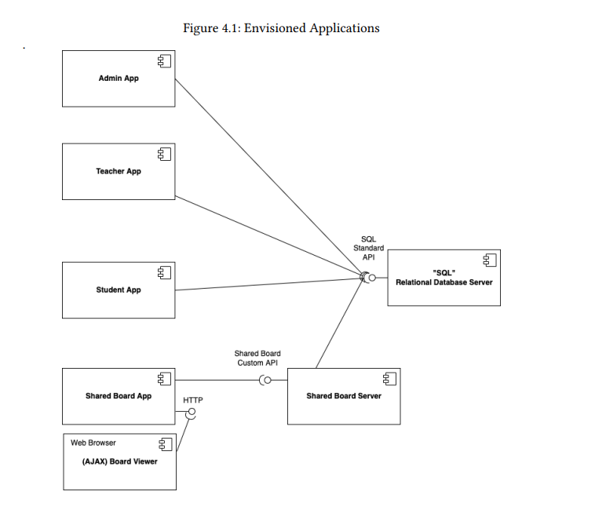

# MVP - Overview

## Context

**Learning Systems (LS)** intends to explore a new innovative software solution for remote learning.
the goal is to develop, in an exploratory way, a new remote learning platform called eCourse, using a minimum viable product (MVP) approach.
The platform should support the activities of the major actors of a course, mainly teachers,
students and managers.

Among several functionalities (described in the next chapter), the new platform should have
the following distinctive features:

* **Automated Exams** - The platform should support a fully automated approach for exams and evaluation. Teachers should be able to design exams using a simple and intuitive language and students should be able to take these exams and automatically have
  feedback and resulting grades after submitting them. The platform should also present dashboards about exam results both to students and teachers.

* **Shared Boards** - Boards are one of the main used tools for teaching. From the old chalk
  boards to the new connected digital boards, boards are one of the most successful teaching tool. The project aims to implement the concept of shared board, as a board that can be used to share and organize ideas and information.

## Functional Requirements

### Users
| User Story Code       | User Story Name                                     | User Story Resume                                                                                |
|:----------------------|:----------------------------------------------------|--------------------------------------------------------------------------------------------------|
| FRU01                 | Management of Users                                 | Create, disable/enable, and list users of the system(Teachers and Students, as well as Managers) |

### Courses
| User Story Code       | User Story Name                                              | User Story Resume                                                                                                                                                      |
|:----------------------|:-------------------------------------------------------------|------------------------------------------------------------------------------------------------------------------------------------------------------------------------|
| FRC01                 | Create Course                                                | Different editions of a course are to be considered different courses (e.g., Intro-Math-Sem01, Intro-Math-Sem02). Only managers are able to execute this functionality |
| FRC02                 | Open/Close Enrollments in Course                             | Only managers are able to execute this functionality                                                                                                                   |
| FRC03                 | Open/Close Course                                            | Only managers are able to execute this functionality                                                                                                                   |
| FRC04                 | Set Course Teachers                                          | Each course may have several teachers and must have only one Teacher in Charge. Only managers are able to execute this functionality                                   |
| FRC05                 | List Courses                                                 | All users are able to execute this functionality                                                                                                                       |
| FRC06                 | Bulk Enroll Students in Course                               | This can be made by importing a csv file with students. Only managers are able to execute this functionality                                                           |
| FRC07                 | Request Enrollment in Course                                 | The student requests to be enrolled in a course                                                                                                                        |
| FRC08                 | Approve/Reject Enlistment in Course                          | A manager approves or rejects a students’ application to a course                                                                                                      |
| FRC09                 | Schedule of Class                                            | A teacher schedule a class (always a recurring class, happens every week). System must check if the Teacher is available for the class period                          |
| FRC10                 | Schedule of Extra Class                                      | A teacher schedule an extraordinary class. An extra class is a one occurrence only and it has a specific group of participants (a subset of the class students)        |
| FRC11                 | Update Schedule of Class                                     | A teacher changes the meetingTime of a specific class (only changes a specific occurrence of a recurring class)                                                               |

### Exams
| User Story Code       | User Story Name                                      | User Story Resume                                                                                                                                                                                                                                                                         |
|:----------------------|:-----------------------------------------------------|-------------------------------------------------------------------------------------------------------------------------------------------------------------------------------------------------------------------------------------------------------------------------------------------|
| FRE01                 | Create Exam                                          | A Teacher creates a new exam. This includes the specification of the exam (i.e., its structure, in accordance with a grammar for exams that is used to validate the specification of the exam)                                                                                            |
| FRE02                 | List Exams                                           | The system displays to a student his/her future exams                                                                                                                                                                                                                                     |
| FRE03                 | List Course Exams                                    | The system displays to a teacher of a course all the exams of the course                                                                                                                                                                                                                  |
| FRE04                 | Take Exam                                            | A Student takes an exam and answer its questions. At the end of the exam, the system should display the feedback and result (i.e., grade) of the exam. The feedback and grade of the exam should be automatically calculated by a parser based on the grammar defined for exams structure |
| FRE05                 | List Grades                                          | The system displays to a students his/her grades                                                                                                                                                                                                                                          |
| FRE06                 | List Course Grades                                   | The system displays the grades of a class (to a teacher of that course)                                                                                                                                                                                                                   |

### Shared Boards
| User Story Code       | User Story Name                                         | User Story Resume                                                                                                                                               |
|:----------------------|:--------------------------------------------------------|-----------------------------------------------------------------------------------------------------------------------------------------------------------------|
| FRB01                 | Create Board                                            | A user creates a board                                                                                                                                          |
| FRB02                 | Share Board                                             | A user shares a board it owns with other users                                                                                                                  |
| FRB03                 | View Board                                              | The system should display, in "real-meetingTime", the shared boards available to the user in a HTML page                                                               |
| FRB04                 | Create Post-it                                          | A user creates a post-it on a board                                                                                                                             |
| FRB05                 | Change Post-it                                          | A user changes a post-it                                                                                                                                        |
| FRB06                 | Undo Post-it Change                                     | A user undo the last modification in a post-it                                                                                                                        |
| FRB07                 | View Board History                                      | A user views a auditLog of updates in a board                                                                                                                    |
| FRB08                 | Archive Board                                           | The owner of a board can archive the board                                                                                                                      |

### Meetings
| User Story Code       | User Story Name                                          | User Story Resume                                                                                                        |
|:----------------------|:---------------------------------------------------------|--------------------------------------------------------------------------------------------------------------------------|
| FRM01                 | Schedule a Meeting                                       | A user schedules a meeting. The system must check if all participants are available and send invitations to participants |
| FRM02                 | Cancel Meeting                                           | A user cancels a meeting that he owns                                                                                    |
| FRM03                 | Accept/Reject Meeting                                    | A user accepts or rejects an invitation to a meeting                                                                     |
| FRM04                 | List Participants                                        | The system displays the lists of participants in a meeting and the response status (accept or reject meeting)            |

## Non-functional Requirements
| User Story Code      | User Story Name                                                                                     | User Story Resume                                                                                                                                                                                                                                                                                                                                                                                                                                                                                                                                                                                                                                                                                                     |
|:---------------------|:----------------------------------------------------------------------------------------------------|-----------------------------------------------------------------------------------------------------------------------------------------------------------------------------------------------------------------------------------------------------------------------------------------------------------------------------------------------------------------------------------------------------------------------------------------------------------------------------------------------------------------------------------------------------------------------------------------------------------------------------------------------------------------------------------------------------------------------|
| NFR01                | Programming language                                                                                | The solution should be implemented using Java as the main language. Other languages can be used in accordance with more specific requirements                                                                                                                                                                                                                                                                                                                                                                                                                                                                                                                                                                         |
| NFR02                | Technical Documentation                                                                             | Project documentation should be always available on the project repository ("docs" folder, markdown format) and, when applicable, in accordance to the UML notation. The development process of every US (e.g.: analysis, design, testing, etc.) must be reported (as part of the documentation)                                                                                                                                                                                                                                                                                                                                                                                                                      |
| NFR03                | Test-driven development                                                                             | The team should develop a relevant set of automated tests for every US / Class / Method. The team should aim to adopt a test-driven development approach                                                                                                                                                                                                                                                                                                                                                                                                                                                                                                                                                              |
| NFR04                | Source Control                                                                                      | The source code of the solution as well as all the documentation and related artifacts should be versioned in a GitHub repository to be provided to the students. Only the main (master) branch will be used (e.g., as a source for releases)                                                                                                                                                                                                                                                                                                                                                                                                                                                                         |
| NFR05                | Continuous Integration                                                                              | The Github repository will provide night builds with publishing of results and metrics                                                                                                                                                                                                                                                                                                                                                                                                                                                                                                                                                                                                                                |
| NFR06                | Deployment and Scripts                                                                              | The repository should include the necessary scripts to build and deploy the solution in a variety of systems (at least Linux and Windows). It should also include a readme.md file in the root folder explaining how to build, deploy and execute the solution                                                                                                                                                                                                                                                                                                                                                                                                                                                        |
| NFR07                | Database                                                                                            | By configuration, the system must support that data persistence is done either "in memory" or in a relational database (RDB). Although in-memory database solutions can be used during development and testing, the solution must include a final deployment where a persistent relational database is used. The system should have the ability to initialize some default data                                                                                                                                                                                                                                                                                                                                       |
| NFR08                | Authentication and Authorization                                                                    | The system must support and apply authentication and authorization for all its users and functionalities                                                                                                                                                                                                                                                                                                                                                                                                                                                                                                                                                                                                              |
| NFR09                | Exam Language                                                                                       | The support for exams (its design, feedback and grading) must follow specific technical requirements, specified in LPROG. The ANTLR tool should be used (https://www.antlr.org/)                                                                                                                                                                                                                                                                                                                                                                                                                                                                                                                                      |
| NFR10                | Shared Board Architecture                                                                           | This functional part of the system has very specific technical requirements. It must follow a client-server architecture, where a client application is used to access the shared boards that should be implemented in a server. Communications between these two components must follow specific protocol described in a document from RCOMP ("Application Protocol"). Also, the client application can not access the relational database, it can only access the server application. The client app should implement an HTTP server to be able to generate the "views" of the boards. This should be done automatically, without the intervention of the users (i.e.,without reload of the web page) by using AJAX |
| NFR11                | Explore Shared Board Synchronization                                                                | This functional part of the system has very specific technical requirements, particularly some concerns about synchronization problems. In fact, several clients will try to concurrently modification boards. As such, to explore and study this concurrency scenario a "model" of a solution must be implemented and evaluated exceptionally using the C programming language, and using processes and semaphores. Specific requirements will be provided in SCOMP                                                                                                                                                                                                                                                        |
| NFR12                | Presentation and Communication                                                                      | This project has some specific requirements regarding communication and presentation of the project and its results. This is a concern of the project and its related to the presentations for the sprint reviews in the context of LAPR4. LAPR4 will provide further specification for this requirement                                                                                                                                                                                                                                                                                                                                                                                                              |
| NFR13                | Design and Implement Shared Board Synchronization                                                   | This functional part of the system has very specific technical requirements, particularly some concerns about synchronization problems. In fact, several clients will try to concurrently modification boards. As such, the solution design and implementation must be based on threads, condition variables and mutexes. Specific requirements will be provided in SCOMP                                                                                                                                                                                                                                                                                                                                                   |
| NFR14                | Deployment                                                                                          | The solution should be deployed using several network nodes. It is expected that, at least, the relational database server and the shared board server be deployed in nodes different from localhost, preferably in the cloud                                                                                                                                                                                                                                                                                                                                                                                                                                                                                         |

## Logical Application Overview

