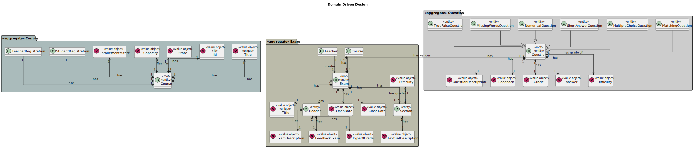
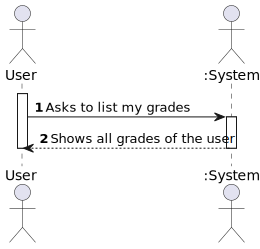
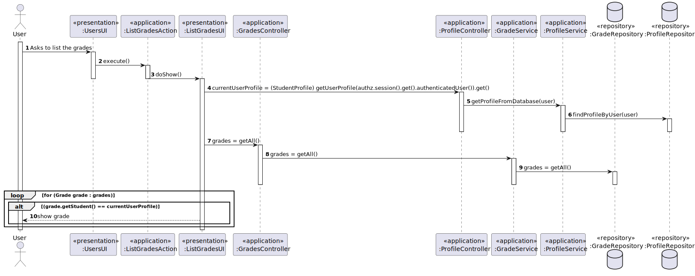
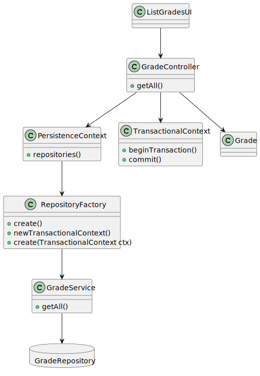

# US 2005

*As Student, I want to view a list of my grades.*

## 1. Context

*The student must be able to list all grades of all exams that the user has done.*

## 2. Requirements

*This functionality has several dependencies, which are US 1001,1002,2001 and 2004*

## 3. Analysis

*Domain Model Excerpt*


*System Sequence Diagram*


## 4. Design

### 4.1. Realization

*Sequence Diagram*


### 4.2. Class Diagram

*Class Diagram*


### 4.3. Applied Patterns

The SOLID principles and the GoF (Gang of Four) design patterns were applied.

### 4.4. Tests

**Test 1:** *Verifies that it is not possible to create an instance of the Example class with null values.*

```
@Test(expected = IllegalArgumentException.class)
public void ensureNullIsNotAllowed() {
	Example instance = new Example(null, null);
}
````

## 5. Implementation

**ListGradesUI**

    public class ListGradesUI extends AbstractUI {

        GradeController controller = new GradeController();
        ProfileController profileController = new ProfileController();
        private final AuthorizationService authz = AuthzRegistry.authorizationService();
        StudentProfile currentUserProfile = (StudentProfile) profileController.getUserProfile(authz.session().get().authenticatedUser()).get();
    
        @Override
        protected boolean doShow() {
            System.out.println("List of Grades\n");
            Set<Grade> gradeSet = controller.getAll();
            int cont=0;
    
            for (Grade grade : gradeSet) {
                if (grade.getStudent() == currentUserProfile){
                    System.out.printf("Course : %s Exam : %s Grade : %d\n", grade.getExam().getCourse().getTitle().getTitle(), grade.getExam().getTitle().getTitle(), grade.getGrade());
                    cont++;
                }
                if (cont==0) System.out.println("This student does not has exams.");
            }
    
            return true;
        }
    
        @Override
        public String headline() {
            return "List Grades";
        }


    }

**GradeController**

    @UseCaseController
    public class GradeController {
        private final GradeService service = new GradeService();

        public Set<Grade> getAll(){return service.getAll();}
    }

**StudentProfile**

    @Service
    public class StudentProfile extends Profile implements DomainEntity<Long> {
        private MecanographicNumber mecanographicNumber;
    
        public StudentProfile(Long id, SystemUser user, DateOfBirth dateOfBirth, TaxPayerNumber taxPayerNumber, MecanographicNumber mechanographicNumber) {
            super(id, user, taxPayerNumber, dateOfBirth);
            this.mecanographicNumber = mechanographicNumber;
        }
    
    
    
        @Override
        public boolean sameAs(Object other) {
            return this.getId() == ((Profile) other).getId();
        }
    
        @Override
        public Long identity() {
            return this.getId();
        }
    
        @Override
        public String toString() {
            return "mecanographic number=" + mecanographicNumber + " name=" + getUser().name();
        }
    }

**JpaGradeRepository**

    public class JpaGradeRepository extends JpaAutoTxRepository<Grade, Long, Long> implements GradeRepository {

        public JpaGradeRepository(String persistenceUnitName) {
            super(persistenceUnitName, "id");
        }
    
        public JpaGradeRepository(String persistenceUnitName, Map properties) {
            super(persistenceUnitName, properties, "id");
        }
    
        public JpaGradeRepository(TransactionalContext tx) {
            super(tx, "id");
        }
    
        @Override
        public Set<Grade> getAll() {
            Iterable<Grade> iterable = this.findAll();
            return StreamSupport.stream(iterable.spliterator(), false).collect(Collectors.toSet());
    
        }
    }

**InMemoryGradeRepository**

    public class InMemoryGradeRepository extends InMemoryDomainRepository<Grade, Long> implements GradeRepository {

        public InMemoryGradeRepository() {
        }
    
        public InMemoryGradeRepository(Function<? super Grade, Long> identityGenerator) {
            super(identityGenerator);
        }
    
    
        @Override
        public Set<Grade> getAll() {
            Iterable<Grade> iterable = this.findAll();
            return StreamSupport.stream(iterable.spliterator(), false).collect(Collectors.toSet());
        }
    }

**Grade**

    @Entity
    @AllArgsConstructor(access = AccessLevel.PUBLIC)
    @NoArgsConstructor(access = AccessLevel.PROTECTED)
    @Getter
    @ToString
    @EqualsAndHashCode
    @Inheritance(strategy = InheritanceType.JOINED)
    public class Grade implements AggregateRoot<Long> {
    
        @Id
        @GeneratedValue(strategy = GenerationType.AUTO)
        private Long id;
    
        @OneToOne(cascade = CascadeType.ALL, fetch = FetchType.EAGER)
        private StudentProfile student;
    
        @OneToOne(cascade = CascadeType.ALL, fetch = FetchType.EAGER)
        private Exam exam;
    
        private int grade;
    
        @Override
        public boolean sameAs(Object other) {
            return this.getId().equals(((Exam) other).getId());
        }
    
        @Override
        public Long identity() {
            return this.getId();
        }
    }


**GradeService**

    public class GradeService {
        private final GradeRepository repository = PersistenceContext.repositories().grade();
    
        public Grade addGrade(Grade grade){
            return repository.save(grade);
        }
    
        public Set<Grade> getAll(){
            return repository.getAll();
        }
    }

**GradeRepository**

    public interface GradeRepository extends DomainRepository<Long, Grade> {

        public Set<Grade> getAll();
    }

## 6. Integration/Demonstration

*In order to create this functionality we had to create the domain classes that were represented in the domain model,repository classes and service classes in order to list the grades in the database, then pure fabrication classes in order to implement the functionality*

*In order to execute this functionality you have to run the script "./run-backoffice.bat" or "./run-user.bat" in the command line being in the directory of the project. After that the application runs, you need to log in as a manager or student, depending which app you are on, and select the Grades menu, and finally select the option to list the grades. Keep in mind that the functionalities listed in the dependencies must be run before this*

## 7. Observations

*It is now possible for any user to list the grades of the user, this action will from now appear on the student Grades menu.*