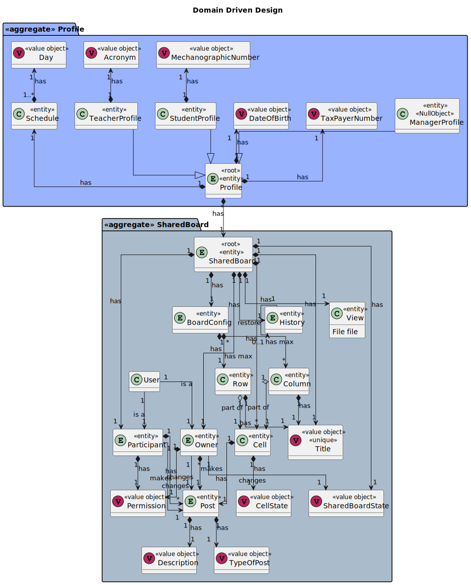
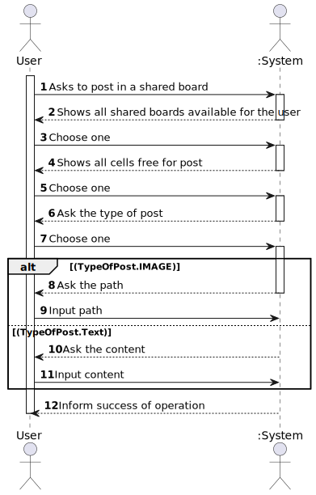
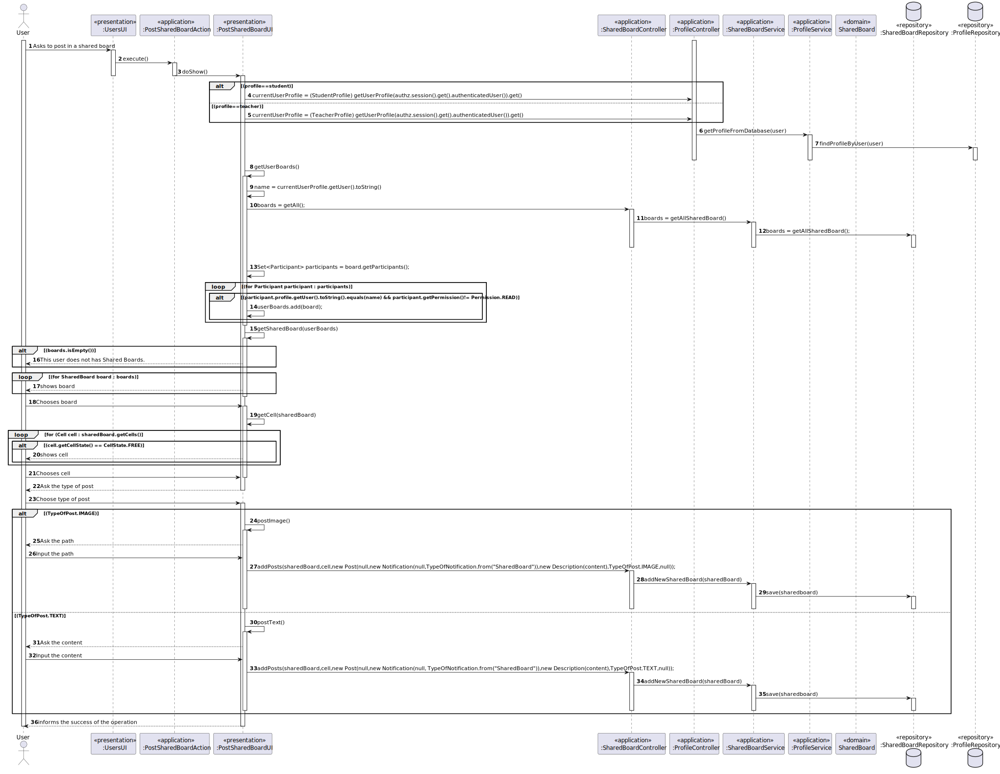
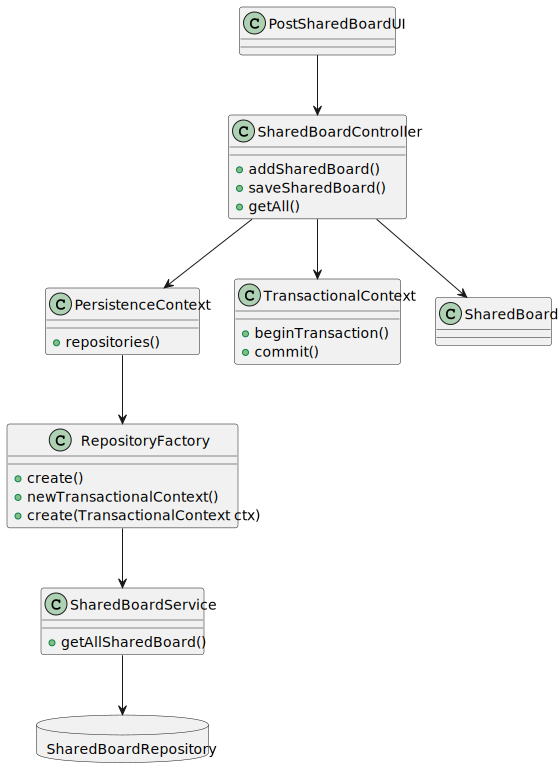

# US 3006

*As User, I want to create a post-it on a board*

## 1. Context

*Any user should be able to make a post in a shared board who participates*

## 2. Requirements

*This functional part of the system has very specific technical requirements, particularly some concerns about synchronization problems.*

*In fact, several clients will try to concurrently modification boards.*

*As such, the solution design and implementation must be based on threads, condition variables and mutexes. Specific requirements will be provided in SCOMP.*

*This functionality has several dependencies, which are US 1001,3002*

## 3. Analysis

*Domain Model Excerpt*


*System Sequence Diagram*


## 4. Design

### 4.1. Realization

*Sequence Diagram*


### 4.2. Class Diagram

*Class Diagram*


### 4.3. Applied Patterns

The SOLID principles and the GoF (Gang of Four) design patterns were applied.

### 4.4. Tests

**Test 1:** *Verifies that it is not possible to create an instance of the Example class with null values.*

```
@Test(expected = IllegalArgumentException.class)
public void ensureNullIsNotAllowed() {
	Example instance = new Example(null, null);
}
````

## 5. Implementation

**PostSharedBoardUI**

    public class PostSharedBoardUI extends AbstractUI {

        private final SharedBoardController controller = new SharedBoardController();
        private final ProfileController profileController = new ProfileController();
    
        private final AuthorizationService authz = AuthzRegistry.authorizationService();
    
        private final StudentProfile currentUserProfile = (StudentProfile) profileController.getUserProfile(authz.session().get().authenticatedUser()).get();
    
    
        @Override
        protected boolean doShow() {
            Set<SharedBoard> userBoards = getUserBoards();
            SharedBoard newSharedBoard = getSharedBoard(userBoards);
            if(newSharedBoard==null){
                return false;
            } else {
    
                Cell cell = getCell(newSharedBoard);
                if(cell==null){
                    return false;
                }
    
                boolean isValid = false;
                do {
                    System.out.printf("Type of Post:\n[1]Text\n[2]Image\n");
                    int option = Console.readInteger("Option :");
                    if (option == 1) {
                        isValid = true;
                        try {
                            postText(newSharedBoard, cell);
                        } catch (BusinessRuleException e) {
                            throw new RuntimeException(e);
                        }
                    } else if (option == 2) {
                        isValid = true;
                        try {
                            postImage(newSharedBoard, cell);
                        } catch (BusinessRuleException e) {
                            throw new RuntimeException(e);
                        }
                    } else {
                        System.out.println("Invalid Option.");
                        isValid = false;
                    }
                } while (!isValid);
    
                System.out.println("Post made with success!");
            }
            return true;
        }
    
    
        public Set<SharedBoard> getUserBoards(){
            String name = currentUserProfile.getUser().toString();
            List<SharedBoard> boards = controller.getAll();
            Set<SharedBoard> userBoards = new HashSet<>();
    
            for (SharedBoard board : boards) {
                Set<Participant> participants = board.getParticipants();
                for (Participant participant : participants) {
                    if (participant.profile.getUser().toString().equals(name) && participant.getPermission()!= Permission.READ){
                        userBoards.add(board);
                    }
                }
            }
            return userBoards;
        }
    
        public SharedBoard getSharedBoard(Set<SharedBoard> boards){
            if(boards.isEmpty()){
                System.out.println("This user does not has Shared Boards.");
                return null;
            } else {
                System.out.println("Which Board do you want to modification?");
    
                Set<Long> ids = new HashSet<>();
                boolean isValidOption = false;
                Long option = 0L;
                do {
                    try {
                        for (SharedBoard board : boards) {
                            System.out.printf("Id:%d Title:%s\n", board.getId(), board.getShrdtitle());
                            ids.add(board.getId());
                        }
                        option = Console.readLong("Option(ID): ");
                        System.out.println();
                        if (ids.contains(option)) {
                            isValidOption = true;
                        } else {
                            System.out.println("Invalid Option!");
                        }
                    } catch (Exception e) {
                        System.out.println("An error occurred on select the SharedBoard: " + e.getMessage());
                    }
                } while (!isValidOption);
    
                for (SharedBoard board : boards) {
                    if (Objects.equals(board.getId(), option)) {
                        return board;
                    }
                }
            }
            return null;
        }
    
        public Cell getCell(SharedBoard sharedBoard){
            System.out.println("Which cell do you want to modification?");
    
            Set<Long> ids= new HashSet<>();
            boolean isValidOption = false;
            Long option = 0L;
            do {
                try {
                    for (Cell cell : sharedBoard.getCells()) {
                        if(cell.getCellState() == CellState.FREE){
                            System.out.printf("Id:%d \n\tRow:%s \n\tColumn:%s\n",cell.getId(),cell.getSharedBoardRows(),cell.getColumn());
                            ids.add(cell.getId());
                        }
                    }
                    if(ids.isEmpty()){
                        System.out.println("This Shared Board does not has free cells to post.");
                        return null;
                    }
                    option = Console.readLong("Option(ID): ");
                    System.out.println();
                    if (ids.contains(option)){
                        isValidOption=true;
                    }else{
                        System.out.println("Invalid Option!");
                    }
                } catch (Exception e) {
                    System.out.println("An error occurred on select the Cell: " + e.getMessage());
                }
            }while (!isValidOption);
    
            for (Cell cell : sharedBoard.getCells()) {
                if(Objects.equals(cell.getId(), option)){
                    return cell;
                }
            }
    
            return null;
    
        }
    
        public void postText(SharedBoard sharedBoard, Cell cell) throws BusinessRuleException {
            System.out.println("Change Cell(Text):");
            String content = Console.readLine("Content: ");
            cell.setCellState(CellState.OCCUPIED);
            controller.addPosts(sharedBoard,cell,new Post(null,new Notification(null, TypeOfNotification.from("SharedBoard")),new Description(content),TypeOfPost.TEXT,null));
        }
    
    
        public void postImage(SharedBoard sharedBoard, Cell cell) throws BusinessRuleException {
            System.out.println("Change Cell(Image):");
            String content = Console.readLine("Image Path: ");
            cell.setCellState(CellState.OCCUPIED);
            controller.addPosts(sharedBoard,cell,new Post(null,new Notification(null,TypeOfNotification.from("SharedBoard")),new Description(content),TypeOfPost.IMAGE,null));
        }
    
        @Override
        public String headline() {
            return "Make a post in a SharedBoard";
        }
    }

**SharedBoardController**

    @UseCaseController
    public class SharedBoardController {
        private final AuthorizationService authz = AuthzRegistry.authorizationService();
    
        ProfileController profileController = new ProfileController();
    
        private final SharedBoardService service = new SharedBoardService();
    
        public SharedBoard addSharedBoard(SharedBoardState state, int maxnumrows, int maxnumcolluns, Set<SharedBoardRows> rows, Set<SharedBoardColumns> columns, String path , String title, Set<Cell> cells) throws Exception {
            Profile adminProfile = profileController.getUserProfile(authz.session().get().authenticatedUser()).get();
            Set<Participant> participants = new HashSet<>();
            participants.add(new Participant(null,Permission.READANDWRITE,adminProfile,null));
            return SharedBoard.from(null,state, new BoardConfig(null,maxnumrows,maxnumcolluns,rows,columns),new History(null, new TreeMap<Integer,SharedBoard>()), new View(null,new File(path)),new SharedBoardTitle(title),cells,new Owner(null,Permission.READANDWRITE,adminProfile,null),participants);
        }
    
        public void saveSharedBoard(SharedBoard sharedBoard){
            service.addNewSharedBoard(sharedBoard);
        }
    
        public void removeBoard(SharedBoard sharedBoard){
            service.removeSharedBoard(sharedBoard);
        }
    
        public List<SharedBoard> getAll() {
            return service.getAllSharedBoard();
        }
    
        public void addPosts(SharedBoard board, Cell cell,Post post){
            cell.setPost(post);
            saveSharedBoard(board);
        }
    }

**ProfileController**

    @UseCaseController
    public class ProfileController {

        private final ProfileService profileService = new ProfileService();
    
        public Profile createTeacherProfile(SystemUser user, Long id, TaxPayerNumber taxPayerNumber, DateOfBirth dateOfBirth, String acronym){
    
            TeacherProfile profile = new TeacherProfile(id, user, dateOfBirth, taxPayerNumber, acronym);
    
            profileService.addNewProfile(profile);
    
            return profile;
        }
    
        public Profile createStudentProfile(SystemUser user, Long id, TaxPayerNumber taxPayerNumber, DateOfBirth dateOfBirth, MecanographicNumber mecanographicNumber){
    
            StudentProfile profile = new StudentProfile(id, user, dateOfBirth, taxPayerNumber, mecanographicNumber);
    
            profileService.addNewProfile(profile);
    
            return profile;
        }
    
        public Profile createAdminProfile(SystemUser user, Long id, TaxPayerNumber taxPayerNumber, DateOfBirth dateOfBirth){
    
            AdminProfile profile = new AdminProfile(id, user, dateOfBirth, taxPayerNumber);
    
            profileService.addNewProfile(profile);
    
            return profile;
        }
    
        public Optional<Profile> getUserProfile(SystemUser user){
            return profileService.getProfileFromDatabase(user);
        }
    
    
        public List<Profile> getTeacherProfiles(){
            return profileService.getTeacherProfiles();
        }
    
        public List<Profile> getStudentProfiles(){
            return profileService.getStudentProfiles();
        }
    
        public List<Profile> getAdminProfiles(){
            return profileService.getAdminProfiles();
        }

    }

**StudentProfile**

    @Service
    public class StudentProfile extends Profile implements DomainEntity<Long> {
        private MecanographicNumber mecanographicNumber;
    
        public StudentProfile(Long id, SystemUser user, DateOfBirth dateOfBirth, TaxPayerNumber taxPayerNumber, MecanographicNumber mechanographicNumber) {
            super(id, user, taxPayerNumber, dateOfBirth);
            this.mecanographicNumber = mechanographicNumber;
        }
    
    
    
        @Override
        public boolean sameAs(Object other) {
            return this.getId() == ((Profile) other).getId();
        }
    
        @Override
        public Long identity() {
            return this.getId();
        }
    
        @Override
        public String toString() {
            return "mecanographic number=" + mecanographicNumber + " name=" + getUser().name();
        }
    }

**TeacherProfile**
    
    public class TeacherProfile extends Profile implements DomainEntity<Long> {
    
        private String acronym;
    
        public TeacherProfile(Long id, SystemUser user, DateOfBirth dateOfBirth, TaxPayerNumber taxPayerNumber, String acronym){
            super(id, user, taxPayerNumber, dateOfBirth);
            this.acronym = acronym;
    
        }
    
        @Override
        public boolean sameAs(Object other) {
            return this.getId() == ((Profile) other).getId();
        }
    
        @Override
        public Long identity() {
            return this.getId();
        }
    
        @Override
        public String toString() {
            return "acronym =" + acronym + " name=" + getUser().name();
        }
    }

**JpaSharedBoardRepository**

    public class JpaSharedBoardRepository extends JpaAutoTxRepository<SharedBoard, Long, Long> implements SharedBoardRepository {

        public JpaSharedBoardRepository(String persistenceUnitName) {
            super(persistenceUnitName, "id");
        }
    
        public JpaSharedBoardRepository(TransactionalContext tx) {
            super(tx, "id");
        }
    
    
        @Override
        public List<SharedBoard> getAllSharedBoard() {
            Iterable<SharedBoard> iterable = this.findAll();
            return StreamSupport.stream(iterable.spliterator(), false).collect(Collectors.toList());
        }
    }

**InMemorySharedBoardRepository**

    public class InMemorySharedBoardRepository extends InMemoryDomainRepository<SharedBoard,Long> implements SharedBoardRepository  {


        public InMemorySharedBoardRepository() {
        }

        public InMemorySharedBoardRepository(Function<? super SharedBoard, Long> identityGenerator) {
            super(identityGenerator);
        }
        @Override
        public List<SharedBoard> getAllSharedBoard() {
            Iterable<SharedBoard> iterable = this.findAll();
            return StreamSupport.stream(iterable.spliterator(), false).collect(Collectors.toList());
        }
    }

**SharedBoard**

    @Entity
    @AllArgsConstructor(access = AccessLevel.PUBLIC)
    @NoArgsConstructor(access = AccessLevel.PROTECTED)
    @Getter
    @Setter
    @ToString
    @EqualsAndHashCode
    @Inheritance(strategy = InheritanceType.JOINED)
    public class SharedBoard implements AggregateRoot<Long> {

        public static SharedBoard from(Long id, SharedBoardState state, BoardConfig boardConfig, History history, View view, SharedBoardTitle shrdtitle, Set<Cell> cells, Owner owner, Set<Participant> participants)throws BusinessRuleException{
            try {
                Preconditions.nonNull(state);
                Preconditions.nonNull(boardConfig);
                Preconditions.nonNull(view);
                Preconditions.nonNull(shrdtitle);
                Preconditions.nonNull(cells);
                Preconditions.nonNull(owner);
            } catch (Exception e) {
                throw new BusinessRuleException(e);
            }
    
    
            return new SharedBoard(id,state,boardConfig,history,view,shrdtitle,cells,owner,participants);
        }
    
        @Id
        @GeneratedValue(strategy = GenerationType.AUTO)
        private Long id;
    
        private SharedBoardState sharedBoardState;
    
        @OneToOne(cascade = CascadeType.ALL, fetch = FetchType.EAGER)
        private BoardConfig boardConfig;
    
        @OneToOne(cascade = CascadeType.ALL, fetch = FetchType.LAZY)
        @JoinColumn
        private History history;
    
        @OneToOne(cascade = CascadeType.ALL, fetch = FetchType.LAZY)
        private View view;
    
        private SharedBoardTitle shrdtitle;
    
        @OneToMany(cascade = CascadeType.ALL, fetch = FetchType.EAGER)
        private Set<Cell> cells;
    
        @OneToOne(cascade = CascadeType.ALL, fetch = FetchType.LAZY)
        private Owner owner;
    
        @OneToMany(cascade = CascadeType.ALL, fetch = FetchType.EAGER)
        private Set<Participant> participants;
    
        @Override
        public boolean sameAs(Object other) {
            return this.getId() == ((SharedBoard) other).getId();
        }
    
        @Override
        public Long identity() {
            return this.getId();
        }
    
    

    }

**SharedBoardService**

    public class SharedBoardService {
        private final SharedBoardRepository repository= PersistenceContext.repositories().sharedboards();
    
        public SharedBoard addNewSharedBoard(SharedBoard sharedboard){
            return repository.save(sharedboard);
        }
    
        public List<SharedBoard> getAllSharedBoard(){
            return repository.getAllSharedBoard();
        }
    
        public void removeSharedBoard(SharedBoard sharedBoard) { repository.remove(sharedBoard);}
    }

**SharedBoardRepository**

    public interface SharedBoardRepository extends DomainRepository<Long, SharedBoard> {
        public List<SharedBoard> getAllSharedBoard();
    }


## 6. Integration/Demonstration

*In order to create this functionality we had to create the domain classes that were represented in the domain model,repository classes and service classes in order to make a post in the database, then pure fabrication classes in order to implement the functionality*

*In order to execute this functionality you have to run the script "./run-backoffice.bat", "./run-user.bat" or "./run-other.bat " in the command line being in the directory of the project. After that the application runs, you need to log in as a manager, student or teacher, depending which app you are on, and select the SharedBoard menu, and finally select the option to make a post. Keep in mind that the functionalities listed in the dependencies must be run before this*

## 7. Observations

*It is now possible for any user to post in a shared board, this action will from now appear on the manager, student and teacher SharedBoard menu.*