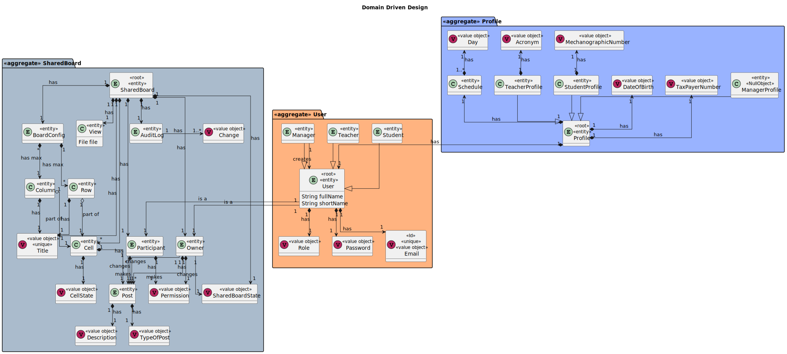
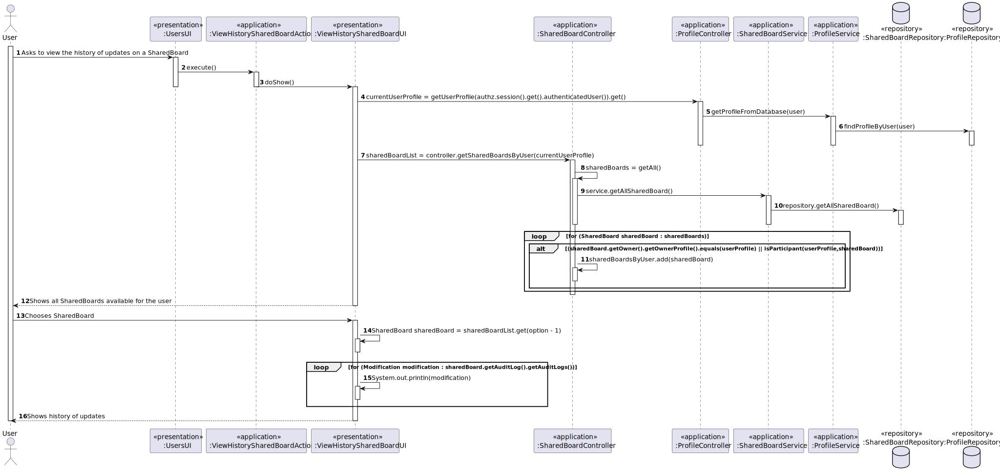
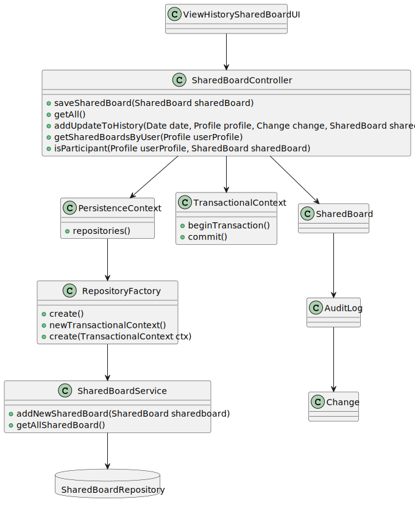

# US 3009

*As User, I want to view the history of updates on a board*

## 1. Context

*After SharedBoards, Users and Post-its are created and registered in the system, any user should be able to view the history of updates on a certain SharedBoard*

## 2. Requirements

*As User, I want to view the history of updates on a board. This functional part of the system has very specific technical requirements, particularly some concerns about synchronization problems.  In fact, several clients will try to concurrently update boards.  As such, the solution design and implementation must be based on threads, condition variables and mutexes. Specific requirements will be provided in SCOMP.
The system should maintain a history/log of all the updates in the board
Any user is able to execute this functionality*

*This functionality has several dependencies, which are US 1001,3002,3006,3007,3008*

*Regarding this requirement we understand that registering users, creating SharedBoards and creating or altering post-its is necessary in order to view the history of updates on a board*

## 3. Analysis

*Domain Model Excerpt*


*System Sequence Diagram*


## 4. Design

### 4.1. Realization

*Sequence Diagram*


### 4.2. Class Diagram

*Class Diagram*


### 4.3. Applied Patterns

The SOLID principles and the GoF (Gang of Four) design patterns were applied.

### 4.4. Tests

**Test 1:** *Verifies that it is not possible to create an instance of the Example class with null values.*

```
@Test(expected = IllegalArgumentException.class)
public void ensureNullIsNotAllowed() {
	Example instance = new Example(null, null);
}
````

## 5. Implementation

**ViewHistorySharedBoardUI**

* This class is different for every user since the profile is different but that is the only change, the rest is the same


    public class ViewHistorySharedBoardUI extends AbstractUI {
        SharedBoardController controller = new SharedBoardController();
        private final AuthorizationService authz = AuthzRegistry.authorizationService();
        private final ProfileController profileController = new ProfileController();
        Scanner sc = new Scanner(System.in);
    
        @Override
        protected boolean doShow() {
    
            int option;
    
            StudentProfile currentUserProfile = (StudentProfile) profileController.getUserProfile(authz.session().get().authenticatedUser()).get();
    
            List<SharedBoard> sharedBoardList = controller.getSharedBoardsByUser(currentUserProfile);
    
            if (sharedBoardList.size() == 0){
                System.out.println("You are not registered in any SharedBoard or there are none created!");
            }else {
                System.out.println("Please choose one of the SharedBoards:");
                for (int i = 0; i < sharedBoardList.size(); i++) {
                    System.out.printf("SharedBoard %d. : %s\n" , i + 1, sharedBoardList.get(i).getShrdtitle().toString());
                }
                option = sc.nextInt();
                SharedBoard sharedBoard = sharedBoardList.get(option - 1);
    
                if (sharedBoard.getAuditLog().getAuditLogs().size() == 0){
                    System.out.println("This SharedBoard hasn't been updated!");
                }else {
                    System.out.printf("History of %s:\n", sharedBoard.getShrdtitle());
                    for (Modification modification : sharedBoard.getAuditLog().getAuditLogs()) {
                        System.out.println(modification);
                        System.out.println("------------------------------------------------------");
                    }
                }
            }
    
            return true;
        }
    
        @Override
        public String headline() {
            return "View the history of updates on a Shared Board";
        }
    }

**SharedBoardController**

    public class SharedBoardController {
        private final AuthorizationService authz = AuthzRegistry.authorizationService();
    
        ProfileController profileController = new ProfileController();
    
        public SharedBoardService service = new SharedBoardService();
    
    
        public SharedBoard addSharedBoard(SharedBoardState state, int maxnumrows, int maxnumcolluns, Set<SharedBoardRows> rows, Set<SharedBoardColumns> columns, String path, String title, Set<Cell> cells) throws Exception {
            Profile adminProfile = profileController.getUserProfile(authz.session().get().authenticatedUser()).get();
            Set<Participant> participants = new HashSet<>();
            participants.add(new Participant(null, Permission.READANDWRITE, adminProfile, null));
            return SharedBoard.from(null, state, new BoardConfig(null, maxnumrows, maxnumcolluns, rows, columns), new AuditLog(null, new TreeSet<Modification>()), new View(null, new File(path)), new SharedBoardTitle(title), cells, new Owner(null, Permission.READANDWRITE, adminProfile, null), participants);
        }
    
        public void saveSharedBoard(SharedBoard sharedBoard) {
            service.addNewSharedBoard(sharedBoard);
        }
    
        public void removeBoard(SharedBoard sharedBoard) {
            service.removeSharedBoard(sharedBoard);
        }
    
        public List<SharedBoard> getAll() {
            return service.getAllSharedBoard();
        }
    
        public void addPosts(SharedBoard board, Cell cell, Post post) {
            cell.setPost(post);
            saveSharedBoard(board);
        }
    
        public void addUpdateToHistory(Date date, Profile profile, Change change, SharedBoard sharedBoard) throws BusinessRuleException {
            Modification newModification = Modification.from(null, date, profile, change);
            sharedBoard.getAuditLog().getAuditLogs().add(newModification);
            saveSharedBoard(sharedBoard);
        }
    
        public SharedBoard getBoardById(Long id) {
            return service.getBoardById(id);
        }
    
        public SharedBoard getBoardId(Long id) {
            List<SharedBoard> sharedBoards = service.getAllSharedBoard();
            for (int i = 0; i < sharedBoards.size(); i++) {
                if (sharedBoards.get(i).getId() == id)
                    return sharedBoards.get(i);
            }
            return null;
        }
    
        public void undoPostIt(SharedBoard sharedBoard, Post post, TypeOfPost typeOfPost, String description) {
            post.setDescription(new Description(description));
            post.setTypeOfPost(typeOfPost);
            saveSharedBoard(sharedBoard);
        }
    
        public List<SharedBoard> getSharedBoardsByUser(Profile userProfile) {
            List<SharedBoard> sharedBoards = getAll();
            List<SharedBoard> sharedBoardsByUser = new ArrayList<>();
            for (SharedBoard sharedBoard : sharedBoards) {
                if (sharedBoard.getOwner().getOwnerProfile().equals(userProfile) || isParticipant(userProfile,sharedBoard)) {
                    sharedBoardsByUser.add(sharedBoard);
                }
            }
            return sharedBoardsByUser;
        }
    
        public boolean isParticipant(Profile userProfile, SharedBoard sharedBoard){
            boolean flag = false;
            for (Participant participant : sharedBoard.getParticipants()){
                if (participant.getProfile().equals(userProfile)) {
                    flag = true;
                    break;
                }
            }
            return flag;
        }
    }

**ProfileController**

    @UseCaseController
    public class ProfileController {

        private final ProfileService profileService = new ProfileService();
    
        public Profile createTeacherProfile(SystemUser user, Long id, TaxPayerNumber taxPayerNumber, DateOfBirth dateOfBirth, String acronym){
    
            TeacherProfile profile = new TeacherProfile(id, user, dateOfBirth, taxPayerNumber, acronym);
    
            profileService.addNewProfile(profile);
    
            return profile;
        }
    
        public Profile createStudentProfile(SystemUser user, Long id, TaxPayerNumber taxPayerNumber, DateOfBirth dateOfBirth, MecanographicNumber mecanographicNumber){
    
            StudentProfile profile = new StudentProfile(id, user, dateOfBirth, taxPayerNumber, mecanographicNumber);
    
            profileService.addNewProfile(profile);
    
            return profile;
        }
    
        public Profile createAdminProfile(SystemUser user, Long id, TaxPayerNumber taxPayerNumber, DateOfBirth dateOfBirth){
    
            AdminProfile profile = new AdminProfile(id, user, dateOfBirth, taxPayerNumber);
    
            profileService.addNewProfile(profile);
    
            return profile;
        }
    
        public Optional<Profile> getUserProfile(SystemUser user){
            return profileService.getProfileFromDatabase(user);
        }
    
    
        public List<Profile> getTeacherProfiles(){
            return profileService.getTeacherProfiles();
        }
    
        public List<Profile> getStudentProfiles(){
            return profileService.getStudentProfiles();
        }
    
        public List<Profile> getAdminProfiles(){
            return profileService.getAdminProfiles();
        }

    }

**ProfileService**

    @Service
    public class ProfileService {
        private final ProfileRepository repository = PersistenceContext.repositories().profiles();
        
            public Profile addNewProfile(Profile profile){
        
                return repository.save(profile);
            }
        
            public Optional<Profile> getProfileFromDatabase(SystemUser user){
        
                Optional<Profile> profile = repository.findProfileByUser(user);
                return profile;
        
            }
        
        
            public List<Profile> getTeacherProfiles(){
                return repository.getTeacherProfiles();
            }
        
        
            public List<Profile> getStudentProfiles(){
                return repository.getStudentProfiles();
            }
        
            public List<Profile> getAdminProfiles(){
                return repository.getAdminProfiles();
            }


    }

**ProfileRepository**

    public interface ProfileRepository extends DomainRepository<Long, Profile> {

        Optional<Profile> findProfileByUser(SystemUser user);
    
        List<Profile> getTeacherProfiles();
    
        List<Profile> getStudentProfiles();
    
        List<Profile> getAdminProfiles();
    }

**JpaProfileRepository**

    public class JpaProfileRepository extends JpaAutoTxRepository<Profile, Long, Long> implements ProfileRepository {

        public JpaProfileRepository(String persistenceUnitName) {
            super(persistenceUnitName, "id");
        }
    
        public JpaProfileRepository(String persistenceUnitName, Map properties) {
            super(persistenceUnitName, properties, "id");
        }
    
        public JpaProfileRepository(TransactionalContext tx) {
            super(tx, "id");
        }
    
    
    
        @Override
        public Optional<Profile> findProfileByUser(SystemUser user) {
            return this.matchOne("e.user.email.email = '" + user.email().toString() + "'");
    
        }
    
    
        @Override
        public List<Profile> getTeacherProfiles() {
            List<Profile> teacherProfiles = new ArrayList<>();
            for (Profile profile : this.findAll()) {
                if (profile instanceof TeacherProfile){
                    teacherProfiles.add(profile);
                }
            }
            return teacherProfiles;
        }
    
    
        @Override
        public List<Profile> getStudentProfiles() {
            List<Profile> studentProfiles = new ArrayList<>();
            for (Profile profile : this.findAll()) {
                if (profile instanceof StudentProfile){
                    studentProfiles.add(profile);
                }
            }
            return studentProfiles;
        }
    
        @Override
        public List<Profile> getAdminProfiles() {
            List<Profile> adminProfiles = new ArrayList<>();
            for (Profile profile : this.findAll()) {
                if (profile instanceof AdminProfile){
                    adminProfiles.add(profile);
                }
            }
            return adminProfiles;
        }


    }

**InMemoryProfileRepository**

    public class InMemoryProfileRepository extends InMemoryDomainRepository<Profile, Long> implements ProfileRepository {

        public InMemoryProfileRepository() {
        }
    
        public InMemoryProfileRepository(Function<? super Profile, Long> identityGenerator) {
            super(identityGenerator);
        }
    
        @Override
        public Optional<Profile> findProfileByUser(SystemUser user) {
            return this.matchOne(profile -> profile.getUser().equals(user));
        }
    
    
        @Override
        public List<Profile> getTeacherProfiles() {
            Iterator<Profile> iterator = this.match(profile -> profile instanceof TeacherProfile).iterator();
            List<Profile> list = new ArrayList<>();
            while (iterator.hasNext()){
                list.add(iterator.next());
            }
    
            return list;
        }
    
    
    
        @Override
        public List<Profile> getStudentProfiles() {
            Iterator<Profile> iterator = this.match(profile -> profile instanceof StudentProfile).iterator();
            List<Profile> list = new ArrayList<>();
            while (iterator.hasNext()) {
                list.add(iterator.next());
            }
    
            return list;
        }
    
        @Override
        public List<Profile> getAdminProfiles() {
                Iterator<Profile> iterator = this.match(profile -> profile instanceof AdminProfile).iterator();
                List<Profile> list = new ArrayList<>();
                while (iterator.hasNext()) {
                    list.add(iterator.next());
                }
    
                return list;
        }
    
    
    
        @Override
        public Optional<Profile> ofIdentity(Long id) {
            return Optional.empty();
        }
    
        @Override
        public void deleteOfIdentity(Long entityId) {
    
        }


    }

**SharedBoard**

    @Entity
    @AllArgsConstructor(access = AccessLevel.PUBLIC)
    @NoArgsConstructor(access = AccessLevel.PROTECTED)
    @Getter
    @Setter
    @ToString
    @EqualsAndHashCode
    @Inheritance(strategy = InheritanceType.JOINED)
    public class SharedBoard implements AggregateRoot<Long> {

        public static SharedBoard from(Long id, SharedBoardState state, BoardConfig boardConfig, AuditLog auditLog, View view, SharedBoardTitle shrdtitle, Set<Cell> cells, Owner owner, Set<Participant> participants)throws BusinessRuleException{
            try {
                Preconditions.nonNull(state);
                Preconditions.nonNull(boardConfig);
                Preconditions.nonNull(view);
                Preconditions.nonNull(shrdtitle);
                Preconditions.nonNull(cells);
                Preconditions.nonNull(owner);
            } catch (Exception e) {
                throw new BusinessRuleException(e);
            }
    
    
            return new SharedBoard(id,state,boardConfig, auditLog,view,shrdtitle,cells,owner,participants);
        }
    
        @Id
        @GeneratedValue(strategy = GenerationType.AUTO)
        private Long id;
    
        private SharedBoardState sharedBoardState;
    
        @OneToOne(cascade = CascadeType.ALL, fetch = FetchType.EAGER)
        private BoardConfig boardConfig;
    
        @OneToOne(cascade = CascadeType.ALL, fetch = FetchType.LAZY)
        private AuditLog auditLog;
    
        @OneToOne(cascade = CascadeType.ALL, fetch = FetchType.LAZY)
        private View view;
    
        private SharedBoardTitle shrdtitle;
    
        @OneToMany(cascade = CascadeType.ALL, fetch = FetchType.EAGER)
        private Set<Cell> cells;
    
        @OneToOne(cascade = CascadeType.ALL, fetch = FetchType.LAZY)
        private Owner owner;
    
        @OneToMany(cascade = CascadeType.ALL, fetch = FetchType.EAGER)
        private Set<Participant> participants;
    
        @Override
        public boolean sameAs(Object other) {
            return this.getId() == ((SharedBoard) other).getId();
        }
    
        @Override
        public Long identity() {
            return this.getId();
        }


    }

**SharedBoardService**

    public class SharedBoardService {
        private final SharedBoardRepository repository= PersistenceContext.repositories().sharedboards();
    
        public SharedBoard addNewSharedBoard(SharedBoard sharedboard){
            return repository.save(sharedboard);
        }
    
        public List<SharedBoard> getAllSharedBoard(){
            return repository.getAllSharedBoard();
        }
    
        public void removeSharedBoard(SharedBoard sharedBoard) {
            repository.remove(sharedBoard);
        }
    
    
        public SharedBoard getBoardById(Long id){
            return repository.findBoardById(id).get();
        }
    }

**SharedBoardRepository**

    public interface SharedBoardRepository extends DomainRepository<Long, SharedBoard> {
        public List<SharedBoard> getAllSharedBoard();
    
        public Optional<SharedBoard> findBoardById(Long id);
    }

**JpaSharedBoardRepository**

    public class JpaSharedBoardRepository extends JpaAutoTxRepository<SharedBoard, Long, Long> implements SharedBoardRepository {

        public JpaSharedBoardRepository(String persistenceUnitName) {
            super(persistenceUnitName, "id");
        }
    
        public JpaSharedBoardRepository(TransactionalContext tx) {
            super(tx, "id");
        }
    
    
        @Override
        public List<SharedBoard> getAllSharedBoard() {
            Iterable<SharedBoard> iterable = this.findAll();
            return StreamSupport.stream(iterable.spliterator(), false).collect(Collectors.toList());
        }
        @Override
        public Optional<SharedBoard> findBoardById(Long id) {
            return this.findById(id);
    
        }
    }

**InMemorySharedBoardRepository**

    public class InMemorySharedBoardRepository extends InMemoryDomainRepository<SharedBoard,Long> implements SharedBoardRepository  {


            public InMemorySharedBoardRepository() {
            }
    
            public InMemorySharedBoardRepository(Function<? super SharedBoard, Long> identityGenerator) {
                super(identityGenerator);
            }
            @Override
            public List<SharedBoard> getAllSharedBoard() {
                Iterable<SharedBoard> iterable = this.findAll();
                return StreamSupport.stream(iterable.spliterator(), false).collect(Collectors.toList());
            }
    
        @Override
        public Optional<SharedBoard> findBoardById(Long id) {
            return this.findById(id);
        }
    }

**AuditLog**

    @Entity
    @Getter
    @AllArgsConstructor(access = AccessLevel.PUBLIC)
    @NoArgsConstructor(access = AccessLevel.PROTECTED)
    @ToString
    @EqualsAndHashCode
    public class AuditLog implements DomainEntity<Long> {

        public static AuditLog from (Long id, Set<Modification> auditLog) throws BusinessRuleException {
            return new AuditLog(id, auditLog);
        }
    
        @Id
        @GeneratedValue(strategy = GenerationType.AUTO)
        private Long id;
    
        @OneToMany(cascade = CascadeType.ALL, fetch = FetchType.EAGER)
        private Set<Modification> auditLogs;
    
        @Override
        public boolean sameAs(Object other) {
            return this.getId().equals(((AuditLog) other).getId());
        }
    
        @Override
        public Long identity() {
            return this.getId();
        }
    }

**Change**

    @Embeddable
    @EqualsAndHashCode
    @AllArgsConstructor(access = AccessLevel.PUBLIC)
    @NoArgsConstructor(access = AccessLevel.PROTECTED)
    @Getter
    public class Change implements ValueObject {

        private String modification;
    
        public static Change from (String change) throws BusinessRuleException {
            try {
                Preconditions.nonNull(change);
                Preconditions.nonEmpty(change);
            } catch (Exception e) {
                throw new BusinessRuleException(e);
            }
    
            return new Change(change);
        }
    
        @Override
        public String toString() {
            return modification;
        }
    }


## 6. Integration/Demonstration

*In order to create this functionality we had to create the domain classes that were represented in the domain model,repository classes and service classes in order to save the AuditLogs and its changes in the database, then pure fabrication classes in order to implement the functionality*

*In order to execute this functionality you have to run the script "./run-backoffice.bat", "./run-user.bat" or "./run-other.bat " in the command line being in the directory of the project. After that the application runs, you need to log in as a manager, student or teacher, depending which app you are on, and select the SharedBoard menu, and finally select the option to view the history of updates on a SharedBoard. Keep in mind that the functionalities listed in the dependencies must be run before this*

## 7. Observations

*It is now possible for any user to view the history of updates on its SharedBoards, this action will from now appear on the manager, student and teacher SharedBoard menu.*