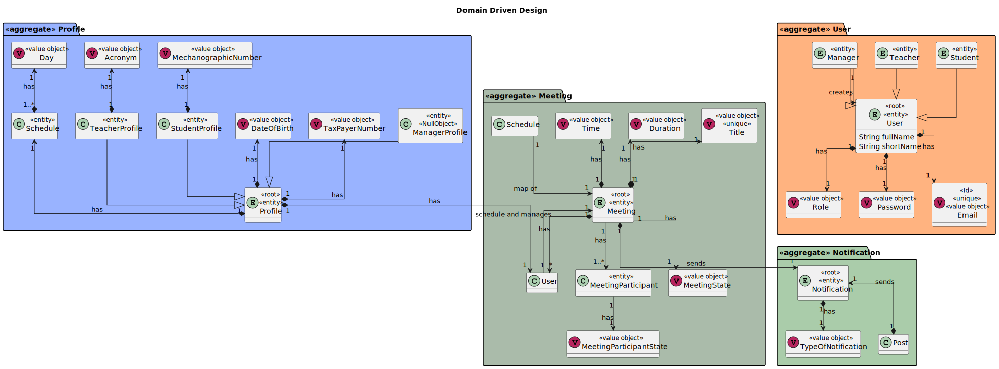
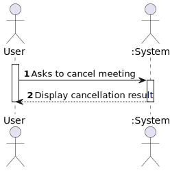
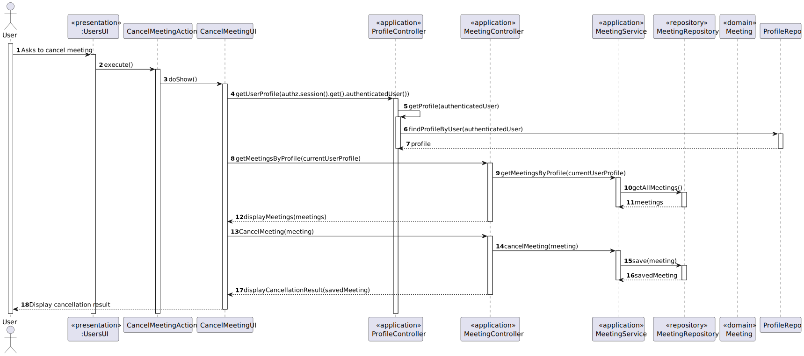
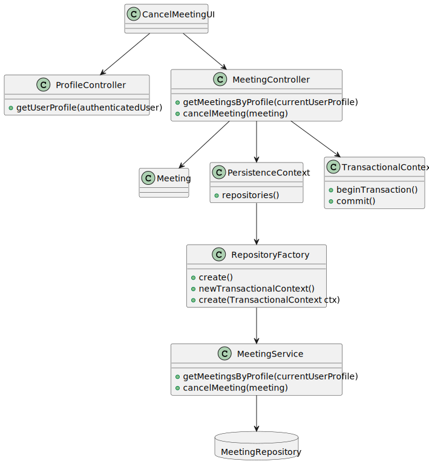

# US 4002

*As User, I want to cancel a meeting*

## 1. Context

*Any user can cancel a meeting that they create*

## 2. Requirements

*This functional part of the system has very specific technical requirements, particularly some concerns about synchronization problems.*

*In fact, several clients will try to concurrently modification boards.*

*As such, the solution design and implementation must be based on threads, condition variables and mutexes. Specific requirements will be provided in SCOMP.*

*This functionality has several dependencies, which are US 1001,4001*

## 3. Analysis

*Domain Model Excerpt*


*System Sequence Diagram*


## 4. Design

### 4.1. Realization

*Sequence Diagram*


### 4.2. Class Diagram

*Class Diagram*


### 4.3. Applied Patterns

The SOLID principles and the GoF (Gang of Four) design patterns were applied.

### 4.4. Tests

**Test 1:** *Verifies that it is not possible to create an instance of the Example class with null values.*

```
@Test(expected = IllegalArgumentException.class)
public void ensureNullIsNotAllowed() {
	Example instance = new Example(null, null);
}
````

## 5. Implementation

*In this section the team should present, if necessary, some evidencies that the implementation is according to the design. It should also describe and explain other important artifacts necessary to fully understand the implementation like, for instance, configuration files.*

*It is also a best practice to include a listing (with a brief summary) of the major commits regarding this requirement.*

## 6. Integration/Demonstration

*In order to create this functionality we had to create the domain classes that were represented in the domain model,repository classes and service classes in order to make a post in the database, then pure fabrication classes in order to implement the functionality*

*In order to execute this functionality you have to run the script "./run-backoffice.bat", "./run-user.bat" or "./run-other.bat " in the command line being in the directory of the project. After that the application runs, you need to log in as a manager, student or teacher, depending which app you are on, and select the Meeting menu, and finally select the option to cancel a meeting. Keep in mind that the functionalities listed in the dependencies must be run before this*

## 7. Observations

*It is now possible for any user to cancel a meeting, this action will from now appear on the manager, student and teacher SharedBoard menu.*