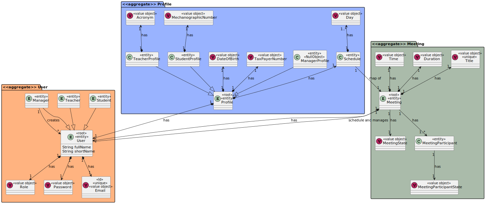

# US 4003

*As User, I want to accept or reject a meeting.*

## 1. Context

*A User who is a participant in a meeting can accept or reject it.*

## 2. Requirements

*This functionality has several dependencies, which are US 1001,4001,4002*

## 3. Analysis

*Domain Model Excerpt*


*System Sequence Diagram*


## 4. Design

### 4.1. Realization

*Sequence Diagram*


### 4.2. Class Diagram

*Class Diagram*


### 4.3. Applied Patterns

The SOLID principles and the GoF (Gang of Four) design patterns were applied.

### 4.4. Tests

**Test 1:** *Verifies that it is not possible to create an instance of the Example class with null values.*

```
@Test(expected = IllegalArgumentException.class)
public void ensureNullIsNotAllowed() {
	Example instance = new Example(null, null);
}
````

## 5. Implementation

**AcceptMeetingRequestUI**

    public class AcceptMeetingRequestUI extends AbstractUI {

        MeetingController meetingController=new MeetingController();
    
    
        @Override
        protected boolean doShow() {
    
            List<Meeting>meetings=meetingController.getMeetings();
            Profile user=meetingController.getAuthz();
    
            for (Meeting meeting : meetings) {
                if (meeting.getMeetingState() == MeetingState.ACCEPTED) {
                    Set<MeetingParticipant> meetingParticipants = meeting.getMeetingParticipants();
                    for (MeetingParticipant meetingParticipant : meetingParticipants) {
                        Profile user1=meetingParticipant.getParticipantProfile();
                        if (user1.equals(user)) {
                            if (meetingParticipant.getMeetingParticipantState() == MeetingParticipantState.PENDING){
                                System.out.println("Meeting-" + meeting.getTitle());
                                MeetingParticipantState meetingParticipantState = null;
                                boolean isValidOption = false;
                                int input;
                                do {
                                    System.out.println("Do you want to accept or reject the Meeting");
                                    System.out.println("1. ACCEPT");
                                    System.out.println("2. REJECT");
                                    try {
                                        input = Console.readInteger("Option: ");
                                        switch (input) {
                                            case 1:
                                                System.out.println("You selected ACCEPT.");
                                                meetingParticipantState = MeetingParticipantState.ACCEPT;
                                                isValidOption = true;
                                                break;
                                            case 2:
                                                System.out.println("You selected REJECT.");
                                                meetingParticipantState = MeetingParticipantState.REJECT;
                                                isValidOption = true;
                                                break;
                                            default:
                                                System.out.println("Invalid option selected. Please try again.");
                                        }
                                    } catch (Exception e) {
                                        System.out.println("An error occurred on accepting or rejecting the meeting: " + e.getMessage());
                                    }
                                } while (!isValidOption);
                                meetingParticipant.setMeetingParticipantState(meetingParticipantState);
                                meetingController.saveMeeting(meeting);
                                break;
                            } else {
                                System.out.println("You have already accepted the meeting"+meeting.getTitle());
                            }
                        }else{
                            System.out.println("You dont have this meeting"+meeting.getTitle());
                        }
                    }
                }
            }
            return false;
        }
    
        @Override
        public String headline() {
            return "Accept or Reject meeting";
        }
    }


**MeetingController**

    @UseCaseController
public class MeetingController {
private final AuthorizationService authz = AuthzRegistry.authorizationService();
private final MeetingService service = new MeetingService();

    ProfileController profileController = new ProfileController();


        public Meeting addMeeting(int duration, int time_hour,int time_min,String title, Profile userProfile,Set<MeetingParticipant> meetingParticipants,MeetingState meetingState) throws Exception {
            return Meeting.from(null,new Duration(duration), new MeetingTime(time_hour,time_min),new Title(title),userProfile, meetingParticipants,meetingState);
    
        }
        public void saveMeeting(Meeting meeting){
            service.addNewMeeting(meeting);
        }
    
    
        public void CancelMeeting(Meeting meeting){
            meeting.setMeetingState(MeetingState.CANCELED);
            service.addNewMeeting(meeting);
        }
        public List<Meeting> getMeetings() {
            List<Meeting> allMeetings= service.getAllMeetings();
            List<Meeting> acceptedMeetings=new ArrayList<>();
            for(int i=0;i<allMeetings.size();i++){
                if(allMeetings.get(i).getMeetingState().equals(MeetingState.ACCEPTED))
                    acceptedMeetings.add(allMeetings.get(i));
            }
            return acceptedMeetings;
        }
        public List<Meeting> getMeetingsByProfile(Profile userProfile) {
            List<Meeting> allMeetings= service.getAllMeetings();
            List<Meeting> acceptedMeetings=new ArrayList<>();
            for(int i=0;i<allMeetings.size();i++){
                if((allMeetings.get(i).getMeetingState().equals(MeetingState.ACCEPTED))&&(allMeetings.get(i).getUserProfile().equals(userProfile)))
                    acceptedMeetings.add(allMeetings.get(i));
            }
            return acceptedMeetings;
        }
    
        public Profile getAuthz() {
            return profileController.getUserProfile(authz.session().get().authenticatedUser()).get();
        }
    
        public List<MeetingParticipant> getParticipants(Meeting meeting){
            List<MeetingParticipant> participants = new ArrayList<>();
            Set<MeetingParticipant> meetingParticipants = meeting.getMeetingParticipants();
            for (MeetingParticipant meetingParticipant : meetingParticipants) {
                if (!meetingParticipant.getMeetingParticipantState().equals(MeetingParticipantState.PENDING)){
                    participants.add(meetingParticipant);
                }
            }
            return participants;
        }
    
        public List<Meeting> getMeetingsByUser(Profile userProfile){
            List<Meeting> meetings = getMeetings();
            List<Meeting> meetingsByUser = new ArrayList<>();
            for (Meeting meeting : meetings) {
                if (meeting.getUserProfile().equals(userProfile) || isParticipant(userProfile, meeting) && meeting.getMeetingState().equals(MeetingState.ACCEPTED)){
                    meetingsByUser.add(meeting);
                }
            }
            return meetingsByUser;
        }
    
        public boolean isParticipant(Profile userProfile, Meeting meeting){
            boolean flag = false;
            for (MeetingParticipant meetingParticipant : meeting.getMeetingParticipants()){
                if (meetingParticipant.getParticipantProfile().equals(userProfile)) {
                    flag = true;
                    break;
                }
            }
            return flag;
        }
    }


**ProfileController**

    @UseCaseController
    public class ProfileController {

        private final ProfileService profileService = new ProfileService();
    
        public Profile createTeacherProfile(SystemUser user, Long id, TaxPayerNumber taxPayerNumber, DateOfBirth dateOfBirth, String acronym){
    
            TeacherProfile profile = new TeacherProfile(id, user, dateOfBirth, taxPayerNumber, acronym);
    
            profileService.addNewProfile(profile);
    
            return profile;
        }
    
        public Profile createStudentProfile(SystemUser user, Long id, TaxPayerNumber taxPayerNumber, DateOfBirth dateOfBirth, MecanographicNumber mecanographicNumber){
    
            StudentProfile profile = new StudentProfile(id, user, dateOfBirth, taxPayerNumber, mecanographicNumber);
    
            profileService.addNewProfile(profile);
    
            return profile;
        }
    
        public Profile createAdminProfile(SystemUser user, Long id, TaxPayerNumber taxPayerNumber, DateOfBirth dateOfBirth){
    
            AdminProfile profile = new AdminProfile(id, user, dateOfBirth, taxPayerNumber);
    
            profileService.addNewProfile(profile);
    
            return profile;
        }
    
        public Optional<Profile> getUserProfile(SystemUser user){
            return profileService.getProfileFromDatabase(user);
        }
    
    
        public List<Profile> getTeacherProfiles(){
            return profileService.getTeacherProfiles();
        }
    
        public List<Profile> getStudentProfiles(){
            return profileService.getStudentProfiles();
        }
    
        public List<Profile> getAdminProfiles(){
            return profileService.getAdminProfiles();
        }

    }

**StudentProfile**

    @Service
    public class StudentProfile extends Profile implements DomainEntity<Long> {
        private MecanographicNumber mecanographicNumber;
    
        public StudentProfile(Long id, SystemUser user, DateOfBirth dateOfBirth, TaxPayerNumber taxPayerNumber, MecanographicNumber mechanographicNumber) {
            super(id, user, taxPayerNumber, dateOfBirth);
            this.mecanographicNumber = mechanographicNumber;
        }
    
    
    
        @Override
        public boolean sameAs(Object other) {
            return this.getId() == ((Profile) other).getId();
        }
    
        @Override
        public Long identity() {
            return this.getId();
        }
    
        @Override
        public String toString() {
            return "mecanographic number=" + mecanographicNumber + " name=" + getUser().name();
        }
    }

**TeacherProfile**

    public class TeacherProfile extends Profile implements DomainEntity<Long> {
    
        private String acronym;
    
        public TeacherProfile(Long id, SystemUser user, DateOfBirth dateOfBirth, TaxPayerNumber taxPayerNumber, String acronym){
            super(id, user, taxPayerNumber, dateOfBirth);
            this.acronym = acronym;
    
        }
    
        @Override
        public boolean sameAs(Object other) {
            return this.getId() == ((Profile) other).getId();
        }
    
        @Override
        public Long identity() {
            return this.getId();
        }
    
        @Override
        public String toString() {
            return "acronym =" + acronym + " name=" + getUser().name();
        }
    }

**JpaMeetingRepository**

    public class JpaMeetingRepository extends JpaAutoTxRepository<Meeting, Long, Long> implements MeetingRepository {
        public JpaMeetingRepository(String persistenceUnitName) {
            super(persistenceUnitName, "id");
        }
    
        public JpaMeetingRepository(String persistenceUnitName, Map properties) {
            super(persistenceUnitName, properties, "id");
        }
    
        public JpaMeetingRepository(TransactionalContext tx) {
            super(tx, "id");
        }
    
    
        @Override
        public List<Meeting> getAllMeetings() {
            Iterable<Meeting> iterable = this.findAll();
            Iterator<Meeting> iterator = iterable.iterator();
    
            List<Meeting> meetingList = new ArrayList<>();
    
            for (Iterator<Meeting> it = iterator; it.hasNext(); ) {
                Meeting meeting = it.next();
                meetingList.add(meeting);
            }
            return meetingList;
        }
    }


**InMemoryMeetingRepository**

    public class InMemoryMeetingRepository extends InMemoryDomainRepository<Meeting,Long> implements MeetingRepository {

        public InMemoryMeetingRepository(){
    
    
        }
    
        public InMemoryMeetingRepository(Function<? super Meeting, Long> identityGenerator) {
            super(identityGenerator);
        }
    
        @Override
        public <S extends Meeting> S save(S entity) {
            return null;
        }
    
        @Override
        public void delete(Meeting entity) {
    
        }
    
        @Override
        public List<Meeting> getAllMeetings() {
            Iterable<Meeting> iterable = this.findAll();
            return StreamSupport.stream(iterable.spliterator(), false).collect(Collectors.toList());
        }
    }

**Meeting**

    @Entity
    @AllArgsConstructor(access = AccessLevel.PROTECTED)
    @NoArgsConstructor(access = AccessLevel.PROTECTED)
    @Getter
    @Setter
    @ToString
    @EqualsAndHashCode
    @Inheritance(strategy = InheritanceType.JOINED)
    
    public class Meeting implements AggregateRoot<Long> {
    
           public static Meeting from (Long id, Duration duration, MeetingTime meetingTime, eapli.base.meeting.domain.Title title, Profile userProfile, Set<MeetingParticipant> meetingParticipants,MeetingState meetingState) throws BusinessRuleException {
            try {
                Preconditions.nonNull(duration);
                Preconditions.nonNull(meetingTime);
                Preconditions.nonNull(title);
            } catch (Exception e) {
                throw new BusinessRuleException(e);
            }
            return new Meeting(id,duration, meetingTime,meetingState,title,userProfile,meetingParticipants);
        }
    
        @Id
        @GeneratedValue(strategy = GenerationType.AUTO)
        private Long id;
    
        private Duration duration;
    
        private MeetingTime meetingTime;
    
        private MeetingState meetingState;
    
        @Column(unique = true)
        private Title title;
    /*
    @OneToOne(cascade = CascadeType.ALL, fetch = FetchType.LAZY)
    private Notification notification;
    */
    @OneToOne(cascade = CascadeType.ALL, fetch = FetchType.LAZY)
    private Profile userProfile;
    
        @OneToMany(cascade = CascadeType.ALL, fetch = FetchType.LAZY)
        private Set<MeetingParticipant> meetingParticipants;
    
    
        @Override
        public boolean sameAs(Object other) {
            return Objects.equals(this.getId(), ((Meeting) other).getId());
        }
    
        @Override
        public Long identity() {
            return this.getId();
        }
    
    
    }


**SharedBoardService**

    public class MeetingService {
        private final MeetingRepository repository = PersistenceContext.repositories().meetings();
    
        public Meeting addNewMeeting(Meeting meeting){
            return repository.save(meeting);
        }
    
        public List<Meeting> getAllMeetings(){
            return repository.getAllMeetings();
        }
    }

**SharedBoardRepository**

    public interface MeetingRepository extends DomainRepository<Long, Meeting> {

        public List<Meeting> getAllMeetings();
    }


## 6. Integration/Demonstration

*In order to create this functionality we had to create the domain classes that were represented in the domain model,repository classes and service classes in order to make a post in the database, then pure fabrication classes in order to implement the functionality*

*In order to execute this functionality you have to run the script "./run-user.bat" or "./run-other.bat " in the command line being in the directory of the project. After that the application runs, you need to log in as a student or teacher, depending which app you are on, and select the Meeting menu, and finally select the option to Accept or Reject a Meeting. Keep in mind that the functionalities listed in the dependencies must be run before this*
## 7. Observations

*It is now possible for a student or a teacher to accept or reject a meeting that they were invited on, this action will from now appear student and teacher Meeting menu.*