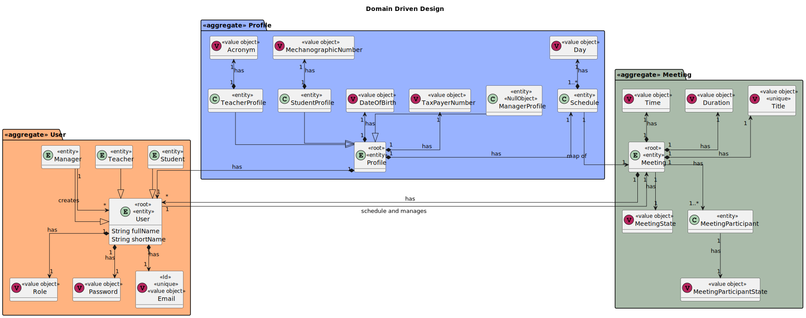
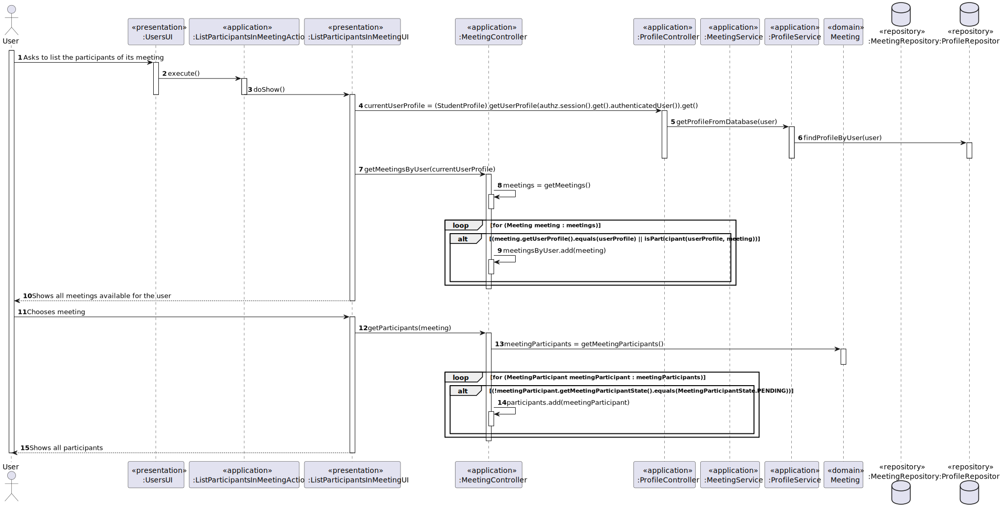
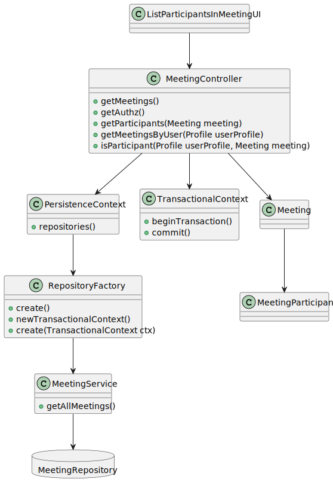

# US 4004

*As User, I want to view a list of participants in my meeting and their status (accept or reject)*

## 1. Context

*After Meetings, Users and Meeting Participants are registered in the system, any user should be able to list the participants of its meetings*

## 2. Requirements

*As User, I want to view a list of participants in my meeting and their status (accept or reject). The system displays the lists of participants in a meeting and
the response status (accept or reject meeting). Any user is able to execute this functionality.*

*This functionality has several dependencies, which are US 1001,4001,4003*

*Regarding this requirement we understand that registering users, scheduling meetings and accepting or rejecting meeting requests is necessary in order to list the participants of a certain meeting*

## 3. Analysis

*Domain Model Excerpt*


*System Sequence Diagram*


## 4. Design

### 4.1. Realization

*Sequence Diagram*


### 4.2. Class Diagram

*Class Diagram*


### 4.3. Applied Patterns

The SOLID principles and the GoF (Gang of Four) design patterns were applied.

### 4.4. Tests

**Test 1:** *Verifies that it is not possible to create an instance of the Example class with null values.*

```
@Test(expected = IllegalArgumentException.class)
public void ensureNullIsNotAllowed() {
	Example instance = new Example(null, null);
}
````

## 5. Implementation

**ListParticipantsInMeetingUI**

    public class ListParticipantsInMeetingUI extends AbstractUI {

        private final MeetingController controller = new MeetingController();
        private final ProfileController profileController = new ProfileController();
        private final AuthorizationService authz = AuthzRegistry.authorizationService();
    
        Scanner sc = new Scanner(System.in);
    
        @Override
        protected boolean doShow() {
    
            int option;
    
            StudentProfile currentUserProfile = (StudentProfile) profileController.getUserProfile(authz.session().get().authenticatedUser()).get();
    
            List<Meeting> meetingsByUser = controller.getMeetingsByUser(currentUserProfile);
    
            if(meetingsByUser.size() == 0) {
                System.out.println("You do not have a scheduled meeting!");
            }else {
    
                System.out.println("Please choose one of your meetings:");
                for (int i = 0; i < meetingsByUser.size(); i++) {
                    System.out.printf("Meeting %d. : %s\n" , i + 1, meetingsByUser.get(i).getTitle().toString());
                }
                option = sc.nextInt();
                Meeting meeting = meetingsByUser.get(option - 1);
    
                List<MeetingParticipant> participantList = controller.getParticipants(meeting);
    
                if (participantList.size() == 0){
                    System.out.println("Your meeting does not have any accepted or rejected participants!");
                }else {
                    System.out.println("Your meeting has this participants:");
                    for (MeetingParticipant meetingParticipant : participantList) {
                        if (!meetingParticipant.getMeetingParticipantState().equals(MeetingParticipantState.PENDING))
                            System.out.printf("%s with Status: %s\n", meetingParticipant.getParticipantProfile(), meetingParticipant.getMeetingParticipantState());
                    }
                }
            }
    
            return true;
        }
    
        @Override
        public String headline() {
            return "List Participants in My Meeting";
        }
    }

**MeetingController**

    @UseCaseController
    public class MeetingController {
        private final AuthorizationService authz = AuthzRegistry.authorizationService();
        private final MeetingService service = new MeetingService();

        ProfileController profileController = new ProfileController();
    
    
        public Meeting addMeeting(int duration, int time_hour,int time_min,String title, Profile userProfile,Set<MeetingParticipant> meetingParticipants,MeetingState meetingState) throws Exception {
            return Meeting.from(null,new Duration(duration), new MeetingTime(time_hour,time_min),new Title(title),userProfile, meetingParticipants,meetingState);
    
        }
        public void saveMeeting(Meeting meeting){
            service.addNewMeeting(meeting);
        }
    
    
        public void CancelMeeting(Meeting meeting){
            meeting.setMeetingState(MeetingState.CANCELED);
            service.addNewMeeting(meeting);
        }
        public List<Meeting> getMeetings() {
            List<Meeting> allMeetings= service.getAllMeetings();
            List<Meeting> acceptedMeetings=new ArrayList<>();
            for(int i=0;i<allMeetings.size();i++){
                if(allMeetings.get(i).getMeetingState().equals(MeetingState.ACCEPTED))
                    acceptedMeetings.add(allMeetings.get(i));
            }
            return acceptedMeetings;
        }
    
        public Profile getAuthz() {
            return profileController.getUserProfile(authz.session().get().authenticatedUser()).get();
        }
    
        public List<MeetingParticipant> getParticipants(Meeting meeting){
            List<MeetingParticipant> participants = new ArrayList<>();
            Set<MeetingParticipant> meetingParticipants = meeting.getMeetingParticipants();
            for (MeetingParticipant meetingParticipant : meetingParticipants) {
                if (!meetingParticipant.getMeetingParticipantState().equals(MeetingParticipantState.PENDING)){
                    participants.add(meetingParticipant);
                }
                break;
            }
            return participants;
        }
    
        public List<Meeting> getMeetingsByUser(Profile userProfile){
            List<Meeting> meetings = getMeetings();
            List<Meeting> meetingsByUser = new ArrayList<>();
            for (Meeting meeting : meetings) {
                if (meeting.getUserProfile().equals(userProfile) || isParticipant(userProfile, meeting)){
                    meetingsByUser.add(meeting);
                }
            }
            return meetingsByUser;
        }
    
        public boolean isParticipant(Profile userProfile, Meeting meeting){
            boolean flag = false;
            for (MeetingParticipant meetingParticipant : meeting.getMeetingParticipants()){
                if (meetingParticipant.getParticipantProfile().equals(userProfile)) {
                    flag = true;
                    break;
                }
            }
            return flag;
        }
    }

**ProfileController**

    @UseCaseController
    public class ProfileController {

        private final ProfileService profileService = new ProfileService();
    
        public Profile createTeacherProfile(SystemUser user, Long id, TaxPayerNumber taxPayerNumber, DateOfBirth dateOfBirth, String acronym){
    
            TeacherProfile profile = new TeacherProfile(id, user, dateOfBirth, taxPayerNumber, acronym);
    
            profileService.addNewProfile(profile);
    
            return profile;
        }
    
        public Profile createStudentProfile(SystemUser user, Long id, TaxPayerNumber taxPayerNumber, DateOfBirth dateOfBirth, MecanographicNumber mecanographicNumber){
    
            StudentProfile profile = new StudentProfile(id, user, dateOfBirth, taxPayerNumber, mecanographicNumber);
    
            profileService.addNewProfile(profile);
    
            return profile;
        }
    
        public Profile createAdminProfile(SystemUser user, Long id, TaxPayerNumber taxPayerNumber, DateOfBirth dateOfBirth){
    
            AdminProfile profile = new AdminProfile(id, user, dateOfBirth, taxPayerNumber);
    
            profileService.addNewProfile(profile);
    
            return profile;
        }
    
        public Optional<Profile> getUserProfile(SystemUser user){
            return profileService.getProfileFromDatabase(user);
        }
    
    
        public List<Profile> getTeacherProfiles(){
            return profileService.getTeacherProfiles();
        }
    
        public List<Profile> getStudentProfiles(){
            return profileService.getStudentProfiles();
        }
    
        public List<Profile> getAdminProfiles(){
            return profileService.getAdminProfiles();
        }

    }

**ProfileService**

    @Service
    public class ProfileService {
        private final ProfileRepository repository = PersistenceContext.repositories().profiles();
        
            public Profile addNewProfile(Profile profile){
        
                return repository.save(profile);
            }
        
            public Optional<Profile> getProfileFromDatabase(SystemUser user){
        
                Optional<Profile> profile = repository.findProfileByUser(user);
                return profile;
        
            }
        
        
            public List<Profile> getTeacherProfiles(){
                return repository.getTeacherProfiles();
            }
        
        
            public List<Profile> getStudentProfiles(){
                return repository.getStudentProfiles();
            }
        
            public List<Profile> getAdminProfiles(){
                return repository.getAdminProfiles();
            }


    }

**ProfileRepository**

    public interface ProfileRepository extends DomainRepository<Long, Profile> {

        Optional<Profile> findProfileByUser(SystemUser user);
    
        List<Profile> getTeacherProfiles();
    
        List<Profile> getStudentProfiles();
    
        List<Profile> getAdminProfiles();
    }

**JpaProfileRepository**

    public class JpaProfileRepository extends JpaAutoTxRepository<Profile, Long, Long> implements ProfileRepository {

        public JpaProfileRepository(String persistenceUnitName) {
            super(persistenceUnitName, "id");
        }
    
        public JpaProfileRepository(String persistenceUnitName, Map properties) {
            super(persistenceUnitName, properties, "id");
        }
    
        public JpaProfileRepository(TransactionalContext tx) {
            super(tx, "id");
        }
    
    
    
        @Override
        public Optional<Profile> findProfileByUser(SystemUser user) {
            return this.matchOne("e.user.email.email = '" + user.email().toString() + "'");
    
        }
    
    
        @Override
        public List<Profile> getTeacherProfiles() {
            List<Profile> teacherProfiles = new ArrayList<>();
            for (Profile profile : this.findAll()) {
                if (profile instanceof TeacherProfile){
                    teacherProfiles.add(profile);
                }
            }
            return teacherProfiles;
        }
    
    
        @Override
        public List<Profile> getStudentProfiles() {
            List<Profile> studentProfiles = new ArrayList<>();
            for (Profile profile : this.findAll()) {
                if (profile instanceof StudentProfile){
                    studentProfiles.add(profile);
                }
            }
            return studentProfiles;
        }
    
        @Override
        public List<Profile> getAdminProfiles() {
            List<Profile> adminProfiles = new ArrayList<>();
            for (Profile profile : this.findAll()) {
                if (profile instanceof AdminProfile){
                    adminProfiles.add(profile);
                }
            }
            return adminProfiles;
        }


    }

**InMemoryProfileRepository**

    public class InMemoryProfileRepository extends InMemoryDomainRepository<Profile, Long> implements ProfileRepository {

        public InMemoryProfileRepository() {
        }
    
        public InMemoryProfileRepository(Function<? super Profile, Long> identityGenerator) {
            super(identityGenerator);
        }
    
        @Override
        public Optional<Profile> findProfileByUser(SystemUser user) {
            return this.matchOne(profile -> profile.getUser().equals(user));
        }
    
    
        @Override
        public List<Profile> getTeacherProfiles() {
            Iterator<Profile> iterator = this.match(profile -> profile instanceof TeacherProfile).iterator();
            List<Profile> list = new ArrayList<>();
            while (iterator.hasNext()){
                list.add(iterator.next());
            }
    
            return list;
        }
    
    
    
        @Override
        public List<Profile> getStudentProfiles() {
            Iterator<Profile> iterator = this.match(profile -> profile instanceof StudentProfile).iterator();
            List<Profile> list = new ArrayList<>();
            while (iterator.hasNext()) {
                list.add(iterator.next());
            }
    
            return list;
        }
    
        @Override
        public List<Profile> getAdminProfiles() {
                Iterator<Profile> iterator = this.match(profile -> profile instanceof AdminProfile).iterator();
                List<Profile> list = new ArrayList<>();
                while (iterator.hasNext()) {
                    list.add(iterator.next());
                }
    
                return list;
        }
    
    
    
        @Override
        public Optional<Profile> ofIdentity(Long id) {
            return Optional.empty();
        }
    
        @Override
        public void deleteOfIdentity(Long entityId) {
    
        }


    }

**Meeting**

    @Entity
    @AllArgsConstructor(access = AccessLevel.PROTECTED)
    @NoArgsConstructor(access = AccessLevel.PROTECTED)
    @Getter
    @Setter
    @ToString
    @EqualsAndHashCode
    @Inheritance(strategy = InheritanceType.JOINED)

    public class Meeting implements AggregateRoot<Long> {

           public static Meeting from (Long id, Duration duration, MeetingTime meetingTime, eapli.base.meeting.domain.Title title, Profile userProfile, Set<MeetingParticipant> meetingParticipants,MeetingState meetingState) throws BusinessRuleException {
            try {
                Preconditions.nonNull(duration);
                Preconditions.nonNull(meetingTime);
                Preconditions.nonNull(title);
            } catch (Exception e) {
                throw new BusinessRuleException(e);
            }
            return new Meeting(id,duration, meetingTime,meetingState,title,userProfile,meetingParticipants);
        }
    
        @Id
        @GeneratedValue(strategy = GenerationType.AUTO)
        private Long id;
    
        private Duration duration;
    
        private MeetingTime meetingTime;
    
        private MeetingState meetingState;
    
        @Column(unique = true)
        private Title title;
        /*
        @OneToOne(cascade = CascadeType.ALL, fetch = FetchType.LAZY)
        private Notification notification;
        */
        @OneToOne(cascade = CascadeType.ALL, fetch = FetchType.LAZY)
        private Profile userProfile;
    
        @OneToMany(cascade = CascadeType.ALL, fetch = FetchType.LAZY)
        private Set<MeetingParticipant> meetingParticipants;
    
    
        @Override
        public boolean sameAs(Object other) {
            return Objects.equals(this.getId(), ((Meeting) other).getId());
        }
    
        @Override
        public Long identity() {
            return this.getId();
        }


    }

**MeetingService**

    public class MeetingService {

        private final MeetingRepository repository = PersistenceContext.repositories().meetings();
        public Meeting addNewMeeting(Meeting meeting){
            return repository.save(meeting);
        }
    
        public List<Meeting> getAllMeetings(){return repository.getAllMeetings();}
    }

**MeetingRepository**

    public interface MeetingRepository extends DomainRepository<Long, Meeting> {

        public List<Meeting> getAllMeetings();
    }

**JpaMeetingRepository**

    public class JpaMeetingRepository extends JpaAutoTxRepository<Meeting, Long, Long> implements MeetingRepository {
        public JpaMeetingRepository(String persistenceUnitName) {
            super(persistenceUnitName, "id");
        }
    
        public JpaMeetingRepository(String persistenceUnitName, Map properties) {
            super(persistenceUnitName, properties, "id");
        }
    
        public JpaMeetingRepository(TransactionalContext tx) {
            super(tx, "id");
        }
    
    
        @Override
        public List<Meeting> getAllMeetings() {
            Iterable<Meeting> iterable = this.findAll();
            Iterator<Meeting> iterator = iterable.iterator();
    
            List<Meeting> meetingList = new ArrayList<>();
    
            for (Iterator<Meeting> it = iterator; it.hasNext(); ) {
                Meeting meeting = it.next();
                meetingList.add(meeting);
            }
            return meetingList;
        }
    }

**InMemoryMeetingRepository**

    public class InMemoryMeetingRepository extends InMemoryDomainRepository<Meeting,Long> implements MeetingRepository {

        public InMemoryMeetingRepository(){
    
    
        }
    
        public InMemoryMeetingRepository(Function<? super Meeting, Long> identityGenerator) {
            super(identityGenerator);
        }
    
        @Override
        public <S extends Meeting> S save(S entity) {
            return null;
        }
    
        @Override
        public void delete(Meeting entity) {
    
        }
    
        @Override
        public List<Meeting> getAllMeetings() {
            Iterable<Meeting> iterable = this.findAll();
            return StreamSupport.stream(iterable.spliterator(), false).collect(Collectors.toList());
        }
    }

**MeetingParticipant**

    @Entity
    @Getter
    @AllArgsConstructor(access = AccessLevel.PUBLIC)
    @NoArgsConstructor(access = AccessLevel.PROTECTED)
    @ToString
    @EqualsAndHashCode
    public class MeetingParticipant implements DomainEntity<Long> {

    public static MeetingParticipant from (Long id, MeetingParticipantState meetingParticipantState,Profile participantProfile) throws BusinessRuleException {
            try {
                Preconditions.nonNull(meetingParticipantState);
            } catch (Exception e) {
                throw new BusinessRuleException(e);
            }
    
            return new MeetingParticipant(id,meetingParticipantState,participantProfile);
        }
    
        @Id
        @GeneratedValue(strategy = GenerationType.AUTO)
        private Long id;
    
        @Column
        private MeetingParticipantState meetingParticipantState;
    
        @OneToOne
        private Profile participantProfile;
    
        @Override
        public boolean sameAs(Object other) {
            return this.getId() == ((MeetingParticipant) other).getId();
        }
    
    
        @Override
        public Long identity() {
            return this.getId();
        }
    
        public void setMeetingParticipantState(MeetingParticipantState meetingParticipantState) {
            this.meetingParticipantState = meetingParticipantState;
        }
    }


## 6. Integration/Demonstration

*In order to create this functionality we had to create the domain classes that were represented in the domain model,repository classes and service classes in order to save the meetings and its participants in the database, then pure fabrication classes in order to implement the functionality*

*In order to execute this functionality you have to run the script "./run-backoffice.bat", "./run-user.bat" or "./run-other.bat " in the command line being in the directory of the project. After that the application runs, you need to log in as a manager, student or teacher, depending which app you are on, and select the Meetings menu, and finally select the option to list the participants in my meeting. Keep in mind that the functionalities listed in the dependencies must be run before this*

## 7. Observations

*It is now possible for any user to list the participants of their meetings, this action will from now appear on the manager, student and teacher SharedBoard menu.*